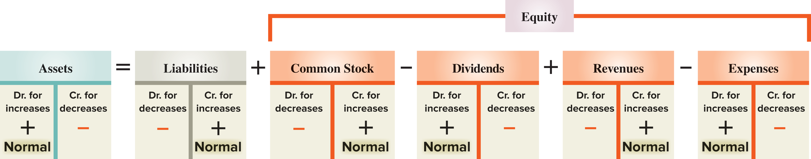
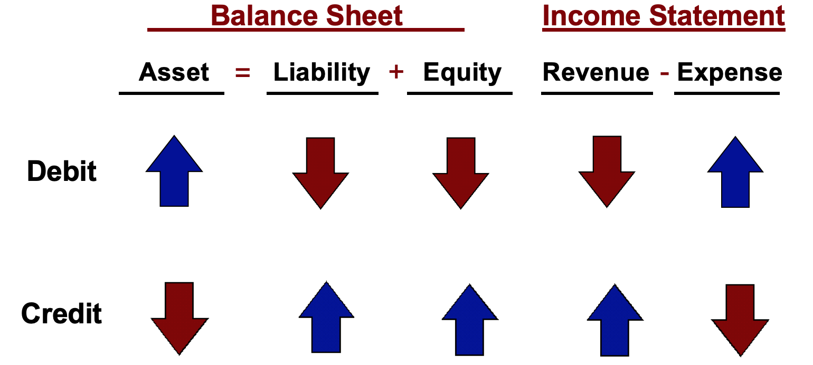
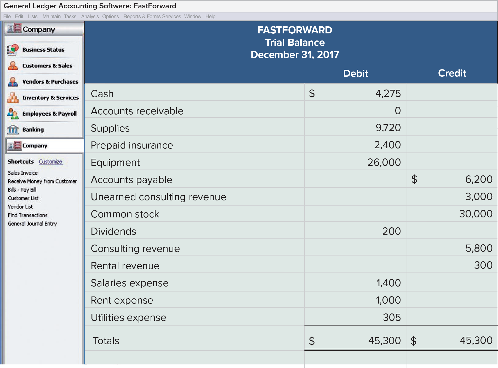
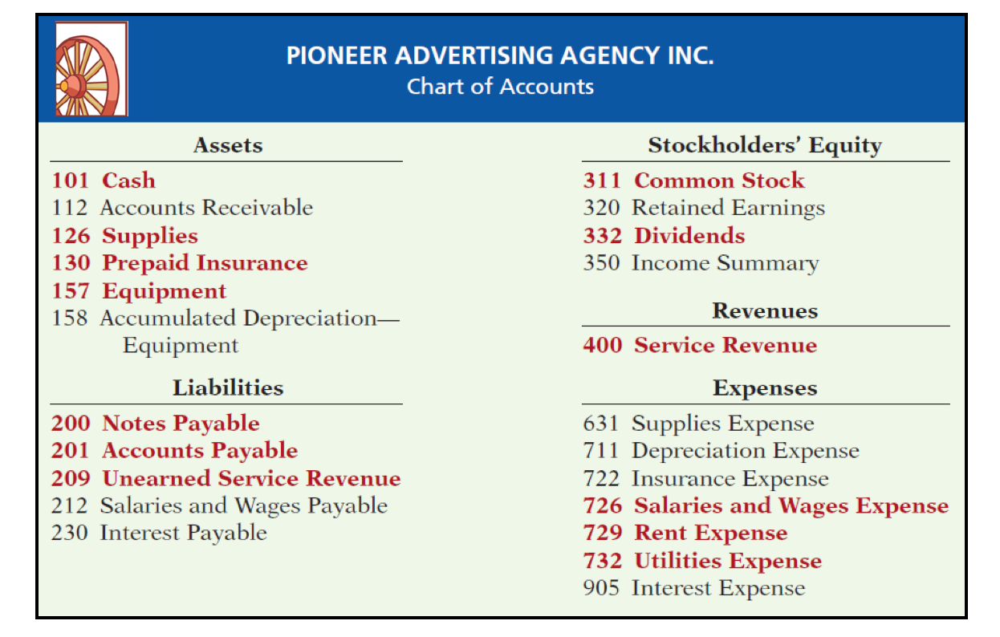
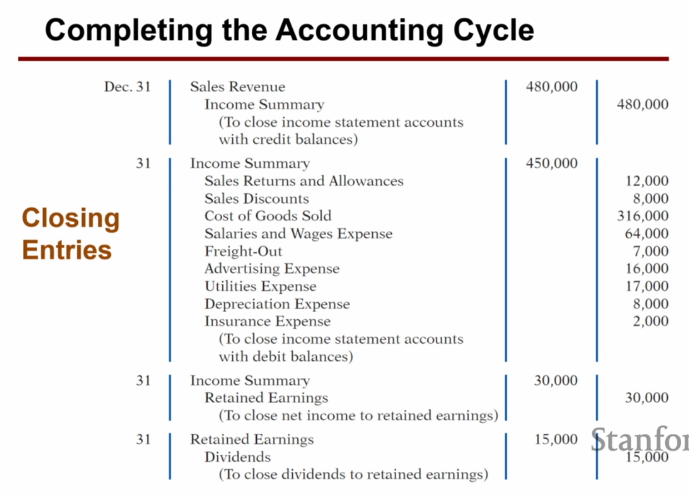

### Chapter 1: Accounting Equation
* Assets = Liability + Shareholder's Equity
  - cash: coins, checks, money orders, and checking account balances
* Retained Earning <- Retained Earning + Net Income - Dividend
* Net income = Revenue - Expense
  - *B* beginning balance
  - *A* add revenue
  - *S* substract expense
  - *E* ending balance
* Cash <- Cash + Net increase in cash.




#### Normal Direction
| Debit     | Credit     |
| :------------- | :------------- |
| Asset, expense, dividend       | liability, revenue, equity       |

___
### Chapter 2: Double Entry System
* Debit must always equal credit.
* Just remember: asset moves up is debit. Anything that moves in order to keep balance must be credit.




* Prepaid insurance
* Unearned service revenue.
* Dividend does not appear on income income. It is not an expense.


#### Income summary
* Receive money, debit asset, credit revenue
* Closing revenue account, debit revenue, credit income summary
* Incur expense, credit expense, debit income summary
* Closing book: debit (decrease) income summary, credit **retained earning**.

#### Dividend
* Credit cash, debit dividend
* closing: credit dividend, debit retained earning.

*Corner case: if overpaying liability, the excess is treated as asset (prepaid expense/rent/insurance), not liability.*

* Creditors are individuals and organizations that have rights to receive payments from a company
* Customers and others who owe a company are called its debtors.
* accrued expense: taxes payable, and interest payable
* A journal gives a complete record of each transaction in one place. It also shows debits and credits for each trans
  - date of transaction
  - b titles of affected accounts
  - c dollar amount of each debit and credit
  - and d explanation of the transaction
* The process of transferring journal entry information to the ledger is called posting
  - When entries are posted to the ledger, the debits in journal entries are transferred into ledger accounts as debits, and credits are transferred into ledger accounts as credits.
* A trial balance is a list of all ledger accounts and their balances (either debit or credit) at a point in time.


___
### Chapter 3: Accrual-basis accounting (GAAP)
* Expense is triggers by expiration of future benefits.
* Revenue incurred when service is delivered.
  - no impact on income statement when cash is received
* Receiving cash doesn't mean revenue.

Adjusting entries
* Prepaid expense/rent/insurance: asset; paid cash before expense is incurred.
  - to adjust account, increase (debit) expense, decrease (credit) asset
  - book value: cost - accumulated depreciation
* Accrued revenue: asset (account receivable)
  - to adjust, debit cash, credit accrued revenue (account receivable)
* Unearned revenue: liability
  - to adjust account, decrease (debit) unearned revenue, increase revenue (credit)
* Accrued expense: liability
  - as future economic benefits expire

Borrow cash:
* debit cash, credit *note payable*
* accrue interest:
  - debit interest expense (same direction as asset)
  - credit interest payable (liability)

Pay salary
* accrue salary: debit salary expense, credit salary payable (liability)
* pay salary: debit salary payable, credit cash

#### Classified balance sheet
Asset classes
* current asset (order matters)
  - cash
  - debt investment
  - account receivable
  - note receivable (< 12 months)
  - inventory
  - supplies
  - prepaid insurance
* long term invest
  - stock investment
  - real estate investment
* PPE: land, equipment, less accumulated depreciation
* intangible asset: patents

Liability classes
* current liability,
  - note, account payable (< 12 month)
  - unearned service revenue
  - salary, wages payable
  - interest payable
* long term liability
  - mortgage payable
  - notes payable (> 12 month)
* stockholder equity

**current ratio** = current assets / current liability  
  - measure of liquidity
  - too high is not good (no economic activity)
  - too low means insolvant



### Chapter 4
* sales revenue - returns & allowance - discount = net sales
* gross profit: net sales - COGS
* operating income: gross margin - operating expense
* net income: operating income + non-operating income
* gross profit/margin ratio: gross margin / net sales

#### Depreciation
* Straight line (easiest, most common)
* Units of activity (most accurate)
* declining balance method: twice the rate of straight line
  - last year takes the residual, do not depreciate below salvage
* DR depreciation expense, CR accumulated depreciation

#### intangible Asset
* amortization: patent
* good will: when business is acquired; cannot create good will; excess payment of asset value
  - not depreciated

#### Inventory
* Beginning + Cost of Goods Purchased = Ending + cost of good sold
* gross profit/margin = sales - COGS
* 2, 10 net 30: 2% discount if paid in 10 days, or pay full amount in 30 days
* paid within discount period: credit cash & inventory
* Sales: debit AR, credit sales, debit COGS, credit inventory
* returns: debit **sales return**, credit AR, debit inventory, credit COGS
* Net sales: sales - sales return - sales discount
* Net sales - COGS = gross profit
* Customer pay with discount: **debit sales discount, cash**, credit AR
* Net income = net sales - operating - non-operating (interest expense, interest revenue, gain/loss of equipment sales)
* FOB shipping point: buyer incurs shipping expense
  - buyer increase (debit inventory), credit cash
* FOB destination: seller incurs shipping expense
  - seller debit **freight out** (operating expense), credit cash
* Sale:
  - DR cash, CR sales
  - DR COGS, CR inventory

#### Stock
* Common stock holders get to vote, but get reward last in liquidation
* authorized stock: how many can issue? = issued stock + treasury stock
* outstanding = issued stock - treasury stock
* only outstanding stock pays dividend
* Par value + paid in val in excess of par = cash debit
  - no-par stock: cash = common stock + paid in val in excess of stated value
* treasury stock is a buffer of retained earning
  * sell above treasury stock price: add additional to paid in treasury
  * sell below purchase price:
* SE = paid in capital + retained earning
  * paid in capital = common stock + additional paid in capital
* treasury stock
  * subtract from SE
  * buy treasury: debit treasury stock, credit cash
  * sell treasury: debit cash, credit treasury stock and
    - debit paid in treasury stock if selling below (decrease SE),
      - if depleted, debit retained earning
    - credit paid in treasury stock if selling above (increase SE)

#### Dividend
* Declaration: DR dividend(Retained Earning) CR payable
* Payment: DR payable, CR cash

#### Cash Flow
CLAD for Operation Cash Flow
* AR increase: decrease cash flow
* AP increase: increase cash flow
* Loss & Gain:
  - loss: add to cash flow
  - gain: subtract from cash flow
* add depreciation
* don't care about expense
```
Dr dep exp
  Cr accu dep
```

Operating acticity (income statement):
* AR, Payable
* inventory
* depreciation
* collecting interest, dividend

Financing activity (long term SE):
* issuing stocks / repurchase treasury stock
* paying Dividend
* issuing/redeem bond, debt (borrow money)

investment (long term asset)
* lending money, collecting cash on loan (not borrowing/repaying)
* acquiring/sale investment/property

Final: 4, 8, 11, 12
